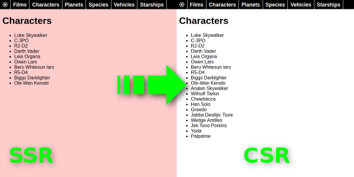

Relaks Star Wars Example - Isomorphic
-------------------------------------
Welcome to part three of the Relaks Starwars saga. In [part one](https://github.com/chung-leong/relaks-starwars-example), we created a very basic page that fetch data from [SWAPI](https://swapi.co/). In [part two](https://github.com/chung-leong/relaks-starwars-example-sequel), we expanded it to something that resembles a real-world website. Now, we'll go one step further by making the front-end isomorphic.

An isomorphic React front-end can render a page on either a web browser or on a server running Node.js. The purpose of server-side rendering (SSR) is first and foremost search engine optimization (SEO). Website crawlers are much better at indexing static HTML pages than single-page JavaScript-driven sites. Providing a static version of your site improves the chance that people will find it.

SSR can also significantly reduce your site's time to first impression. On this matrix, single-page sites are often quite poor. The size of a modern JavaScript program can easily exceed 1MB. And after the code loads, it needs to retrieve data to generate a page. That could take seconds, during which the impatient among your visitors might hit the back button. SSR allows you to show them the initial appearance of your app instead of a loading animation.

This SSR page is completely static--it's just HTML. Unless the visitor has super-human reflex though, he wouldn't be able to tell. By the time he initiates his first interaction with the page, the code would likely have been loaded. Because the same code is used for both SSR and CSR, the transition from one to the other is seamless.

With proper page caching, time to first impression can match that of a static HTML page.

## Live demo

You can see the code in action [here](https://trambar.io/starwars-react/characters/). When the page is rendered on the server side, it has a reddish background color. The color is removed once the client takes over. This can happen in less than a second as the front-end is fairly small. You might want to activate bandwidth throttling to slow things down a bit. Hit the browser's refresh button to to see the SSR version again.

[](https://trambar.io/starwars-react/characters/)

If you wish to see the SEO version, disable JavaScript for the site. On Chrome, you can do this by clicking the lock icon next to the page URL and select "Site settings".

## Getting started

To see the code running in debug mode, first clone this repository. In the working folder, run `npm install`. Once that's done, run `npm run watch` to rebuild the code with debugging enabled. In a different terminal, run `node server/index.js`. Open a browser window and enter `http://localhost:8080/starwars/` as the location. To see the server-side code in debug mode, run `node --inspect server/index.js`. Open a Chrome window and navigate to `chrome://inspect/`. The server script will be listed under **Remote Target**. Click on it to enter the debugger.

## SSR and Relaks

Conceptually, enabling SSR on a front-end using Relaks is very simple: We just need to wait for all promises to be fulfilled. The [relaks-harvest](https://github.com/chung-leong/relaks-harvest) library is designed exactly for this task. Given a `ReactElement`, `harvest()` will recursively render all child elements.  Once everything is rendered, it returns asynchronously a tree containing only HTML and text nodes. This tree can then be passed to [`ReactDOMServer.renderToString()`](https://reactjs.org/docs/react-dom-server.html#rendertostring).

## Adjustments to WebPack configuration

The first thing we need to do to enable SSR is to add a new build target in our WebPack configuration. By default, WebPack generates code suitable for web-browsers. We need to ask WebPack to prepare a separate build for a Node.js environment. In [webpack.config.js](https://github.com/chung-leong/relaks-starwars-example-isomorphic/blob/react/webpack.config.js#L96), we change the export statement to the following:

```javascript
module.exports = [ serverConfig, clientConfig ];
```

The variable `clientConfig` holds the configuration for the client build. The variable `serverConfig` meanwhile holds the configuration for the server build:

```JavaScript
var serverConfig = {
    mode: clientConfig.mode,
    context: clientConfig.context,
    entry: './ssr',
    target: 'node',
    output: {
        path: Path.resolve('./server/client'),
        filename: 'front-end.js',
        chunkFilename: '[name].js',
        libraryTarget: 'commonjs2',
        publicPath: '/starwars',
    },
    resolve: clientConfig.resolve,
    module: clientConfig.module,
    plugins: [
        new NamedChunksPlugin,
        new HtmlWebpackPlugin({
            template: Path.resolve(`./src/index.html`),
            filename: Path.resolve(`./server/client/index.html`),
        }),
        new MiniCSSExtractPlugin({
            filename: "[name].css",
            chunkFilename: "[id].css"
        }),
    ],
    devtool: clientConfig.devtool,
};
```

The most notable difference is the specification of `node` as the target. The entry point is different. The output options are also different. We save the output files to `server/client`. Our Node.js code will be reading from this directory. We also have to specify `commonjs2`, the format used by Node.js, as the library target. For reasons unknown, this is not done automatically.

Another thing we need to do is extract CSS rules to a separate .css file instead of loading them through JavaScript. It's a common task that was omitted from the earlier examples. WebPack's [Mini CSS Extract Plugin](https://github.com/webpack-contrib/mini-css-extract-plugin) is used for this purpose.

## Client-side code changes

The source file [ssr.js](https://github.com/chung-leong/relaks-starwars-example-isomorphic/blob/react/src/ssr.js) contains the bootstrap code for our SSR build. It exports the function `render()`. The function will be called by our Node.js code.

```javascript
import { createElement } from 'react';
import { renderToString } from 'react-dom/server';
import { FrontEnd } from 'front-end';
import { routes } from 'routing';
import DjangoDataSource from 'relaks-django-data-source';
import RouteManager from 'relaks-route-manager';
import { harvest } from 'relaks-harvest';

const dataSourceBaseURL = '/starwars/api';
const basePath = '/starwars';

async function render(options) {
    const dataSource = new DjangoDataSource({
        baseURL: `${options.host}${dataSourceBaseURL}`,
        fetchFunc: options.fetch,
    });
    dataSource.activate();

    const routeManager = new RouteManager({
        routes,
        basePath,
    });
    routeManager.activate();
    await routeManager.start(options.path);

    const ssrElement = createElement(FrontEnd, { dataSource, routeManager, ssr: options.target });
    const rootNode = await harvest(ssrElement);
    const html = renderToString(rootNode);
    return html;
}

export {
    render,
    basePath,
};
```

The function initiates the data source and route manager using options provided by our server-side code. Then it creates the `FrontEnd` element and give it to `harvest()`. One by one, the UI of each component is captured and expanded. Finally, when `harvest()` finishes, the HTML tree is converted to a text string with the help of [`ReactDOMServer`](https://reactjs.org/docs/react-dom-server.html#rendertostring).

On the client-side, we can call `RouteManager.start()` without any argument, as the current URL can be obtained from the `location` object. Here, we need to provide the path that the server has received.

The `ssr` prop given to `FrontEnd` has two possible values: `seo` and `hydrate`. It lets the front-end make adjustments based on whether it's generating HTML for SEO. The `fetchList()` and `fetchMultiple()` methods in ['swapi.js'](https://github.com/trambarhq/relaks-starwars-example-isomorphic/blob/master/src/swapi.js) are modified as follows:

```javascript
fetchList(url, options) {
    if (this.ssr === 'seo') {
        options = Object.assign({}, options, { minimum: '100%' });
    }
    return this.dataSource.fetchList(url, options);
}

fetchMultiple(urls, options) {
    if (this.ssr === 'seo') {
        options = Object.assign({}, options, { minimum: '100%' });
    }
    return this.dataSource.fetchMultiple(urls, options);
}
```

When we're optimizing for search, we place all available contents into the static page. When we're optimizing for latency, we only load a single page of data, presumably enough to fill the screen.

Our client-side bootstrap code looks more or less as before:

```javascript
import { createElement } from 'react';
import { hydrate, render } from 'react-dom';
import { FrontEnd } from 'front-end';
import { routes } from 'routing';
import DjangoDataSource from 'relaks-django-data-source';
import RouteManager from 'relaks-route-manager';
import { harvest } from 'relaks-harvest';
import { plant } from 'relaks';

window.addEventListener('load', initialize);

const dataSourceBaseURL = '/starwars/api';
const basePath = '/starwars';

async function initialize(evt) {
    // create data source
    const host = `${location.protocol}//${location.host}`;
    const dataSource = new DjangoDataSource({
        baseURL: `${host}${dataSourceBaseURL}`,
    });
    dataSource.activate();

    // create route manager
    const routeManager = new RouteManager({
        routes,
        basePath,
    });
    routeManager.activate();
    await routeManager.start();

    const container = document.getElementById('react-container');
    const ssrElement = createElement(FrontEnd, { dataSource, routeManager, ssr: 'hydrate' });
    const seeds = await harvest(ssrElement, { seeds: true });
    plant(seeds);
    hydrate(ssrElement, container);

    const csrElement = createElement(FrontEnd, { dataSource, routeManager });
    render(csrElement, container);
}
```

The critical addition here is the call to `harvest()`. It's used to generate the same contents that the server had done. We pass the option `{ seeds: true }` so that function would return the rendering results of asynchronous components. These "seeds" are given to Relaks, which will use them during the initial rendering cycle in lieu of calling async render functions.

For the first `FrontEnd` element, `ssr` is set to `hydrate`, matching what was done on the server. The prop can be used to bypass operations that only make sense in the CSR context in certain usage scenarios. Suppose a section in our front-end uses the [Geolocation API](https://developer.mozilla.org/en-US/docs/Web/API/Geolocation_API) to find shops near the visitor. We don't want this code to run in Node.js, since the capability simply isn't there. We also don't want this code to run in the browser during the initial dry-run, since obtaining the user's location requires permission. `harvest()` would otherwise end up getting stuck on a promise that isn't fulfilled until the user click the "Allow" button.

`hydrate()` is used to render the front-end element into an already populated DOM node. See the [React documentation](https://reactjs.org/docs/react-dom.html#hydrate) for more details.

The second `FrontEnd` element is used to turn off the `ssr` flag.

## Adjustments to HTML template

The `body` element in [index.html](https://github.com/chung-leong/relaks-starwars-example-isomorphic/blob/react/src/index.html) was changed from

```html
<body>
    <div id="react-container"></div>
</body>
```
to

```html
<body class="ssr">
    <div id="react-container"><!--REACT--></div>
</body>
```

The class name allows us to style the page a little differently depending on whether it's SSR or CSR. It's removed when `FrontEnd` is mounted. The HTML comment lets our server-side code know where to place the generated contents.

## Server-side code

Our server-side code consists of a single script: [index.js](https://github.com/chung-leong/relaks-starwars-example-isomorphic/blob/react/server/index.js). It uses [Express](https://expressjs.com/) to handle page requests. The following function is responsible for generating SSR pages:

```javascript
async function handlePageRequest(req, res) {
    try {
        const host = getHostLocation(req);
        const path = req.url;
        const noScript = (req.query.js === '0');
        const target = (req.isSpider() || noScript) ? 'seo' : 'hydrate';
        const options = { host, path, target, fetch: CrossFetch };
        const frontEndHTML = await FrontEnd.render(options);
        const indexHTMLPath = `${__dirname}/client/index.html`;
        let html = await replaceHTMLComment(indexHTMLPath, 'REACT', frontEndHTML);
        if (target === 'hydrate') {
            // add <noscript> tag to redirect to SEO version
            const meta = `<meta http-equiv=refresh content="0; url=?js=0">`;
            html += `<noscript>${meta}</noscript>`;
        }
        res.type('html').send(html);
    } catch (err) {
        handleRequestError(res, err);
    }
}
```

An Express middleware is used to detect if the request is from a search engine spider. When it is so--or when a query variable indicates the lack of JavaScript support--we set the SSR target to `seo`.

`FrontEnd` is the SSR build of our front-end. We call its `render()` function and wait for it to give us the HTML. We then stick that into `index.html` and send it to the browser.

The remaining code deals mainly with data retrieval. While in the previous examples we fetch data from [SWAPI.co](https://SWAPI.co), here we handle data requests ourselves so that the demonstration is more realistic.

## Usage scenarios

One thing you might notice while looking at the [example](https://trambar.io/starwars-react/films/) is how clicking on a link brings up the page almost instantaneously. This is because we must fetch a complete object even when we only need just one of its properties. To render the **Films** page, we only need the films' titles. But we end up fetching all the information concerning them. The extra information enables us to display something immediately when the user subsequently clicks on a link. The inefficiency of a REST API actually works to our advantage by acting as a data-prefetch mechanism.

The dynamic described above can be especially useful at a content-heavy website. Imagine you're building a news portal. The front page will link to 20, 30 stories. For each story, a title and a short blurb is shown. Your REST API always returns complete objects. The full texts of the story are therefore fetched as well. If text is around 20 KB in size, your page wouldn't be ready until 400-600 KB have been downloaded. Visitors would be staring at a loading animation in the meantime if yours is a pure client-side solution. Employing server-side rendering masks this transfer time. Since the server will send only what's actually shown (titles and short blurbs), the (static) page will load quickly. While the visitors are looking at the list and contemplating which story they wish to read, stories are silently transferred to their computers. When they finally decides to click on one, it'll be there already. The story will appear immediately. If he doesn't like it, he can quickly go back to the list and choose another. The lack of a loading time penalty means visitors will be more willing to give a story a chance. That in turns helps increase page views at your site.

## Final words

We've reached the end of our trilogy of examples. Starting out with a very crude page we managed to build something with a certain measure of sophistication. I hope you managed to follow the code without difficulty. That's the goal of Relaks: making it easy to program with React. If there's anything unclear, please [let me know](https://github.com/chung-leong/relaks-starwars-example-isomorphic/issues).

The Star Wars API examples only deal with data retrieval. If you wish to see an example involving data modification and user authentication, please consult the [Django todo list example](https://github.com/chung-leong/relaks-django-todo-example).
